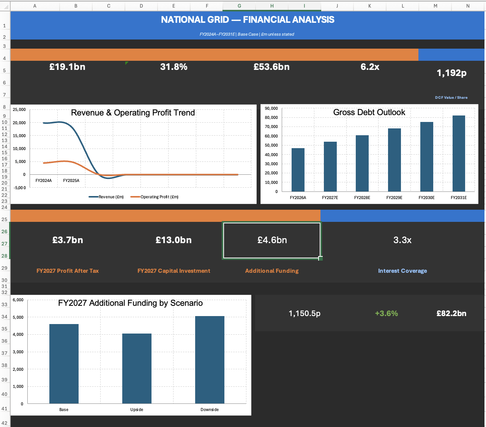
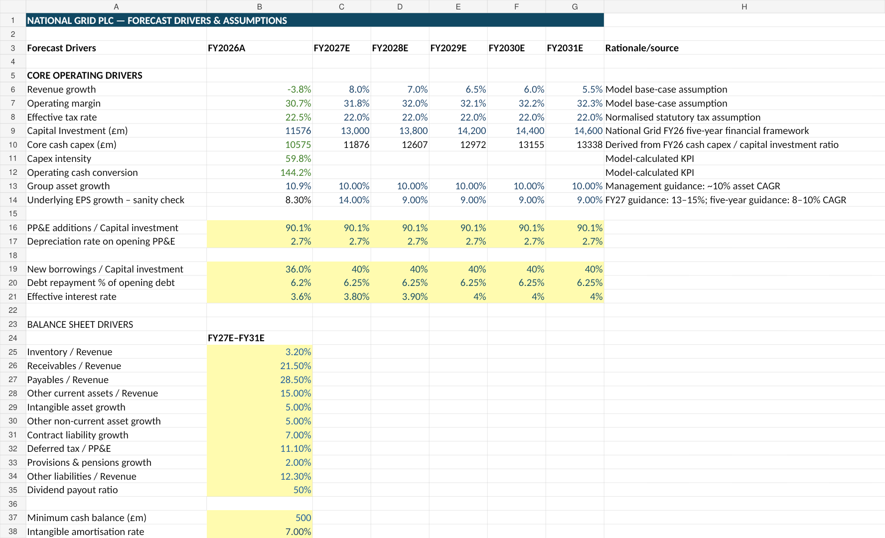
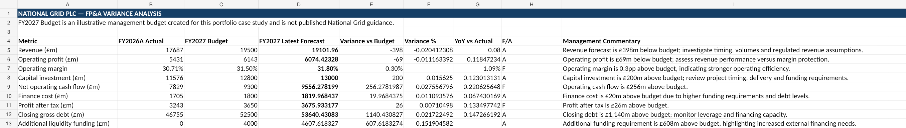
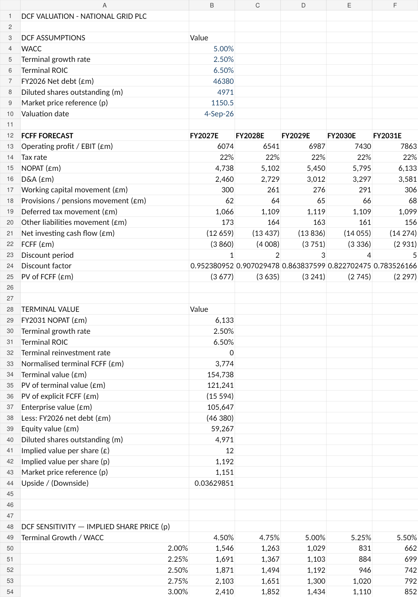
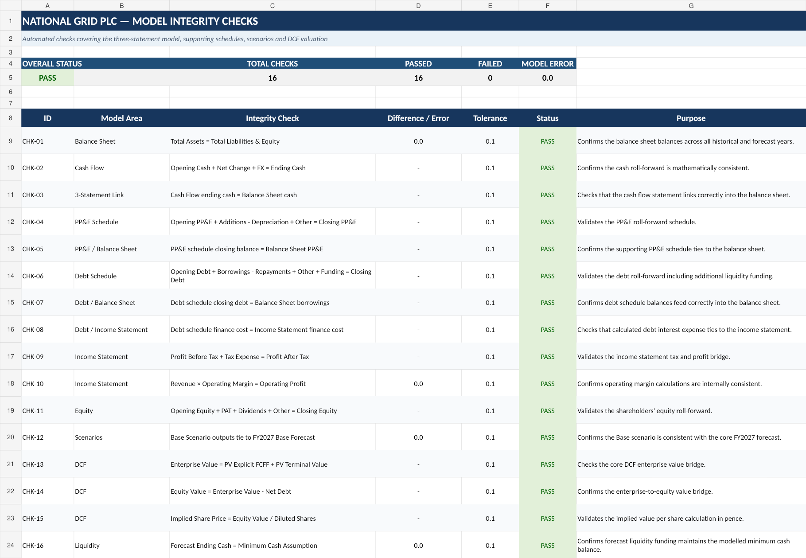

# National Grid PLC — FP&A, Three-Statement Financial Model & DCF Valuation

## Project Overview

This project is an Excel-based FP&A and financial modelling case study of National Grid plc using publicly available financial information. The model covers **FY2024A–FY2026A historical performance** and a **FY2027E–FY2031E forecast period**.

The workbook integrates historical financial statements, driver-based forecasting, capital investment and PP&E schedules, debt and interest modelling, cash flow forecasting, FP&A variance analysis, KPI reporting, scenario analysis and a DCF valuation.

The project was built to demonstrate practical skills relevant to **Financial Analyst, FP&A, Finance Graduate and Financial Modelling roles**.

---

## Model Scope

The workbook contains the following analytical modules:

- Historical income statement, balance sheet and cash flow analysis
- Forecast drivers and operating assumptions
- Forecast income statement
- Forecast balance sheet
- Forecast cash flow statement
- Capital investment and PP&E roll-forward
- Debt, additional funding and interest schedule
- FY2027 Budget vs Latest Forecast variance analysis
- Financial KPI and ratio analysis
- Base / Upside / Downside scenario analysis
- DCF valuation and WACC / terminal-growth sensitivity analysis
- Management dashboard and financial charts
- Automated model-integrity checks across the three-statement model, schedules, scenarios and DCF

---

## Model Preview

### Executive Dashboard



### Forecast Drivers



### FP&A Budget vs Latest Forecast



### DCF Valuation



### Automated Model Checks



---

## Forecast Framework

The model uses a driver-based forecast approach rather than simply extending historical values.

Key forecast drivers include:

- Revenue growth
- Operating margin
- Effective tax rate
- Capital investment
- PP&E additions as a percentage of capital investment
- Depreciation rate on opening PP&E
- New borrowings as a percentage of capital investment
- Debt repayments as a percentage of opening debt
- Effective interest rate
- Working-capital ratios
- Intangible asset growth
- Contract liability growth
- Deferred tax assumptions
- Dividend payout ratio
- Minimum cash balance

The model also incorporates National Grid-specific assumptions documented in the workbook, including the capital investment framework, asset-growth guidance and EPS growth sanity checks.

---

## Three-Statement Forecast

### Income Statement

The forecast model projects revenue, operating profit, finance costs, profit before tax, tax expense and profit after tax through FY2031E.

### Balance Sheet

The balance sheet forecast includes PP&E, intangible assets, working capital, cash, borrowings, deferred tax liabilities, provisions, other liabilities and equity.

A balance-sheet check is included within the forecast statement and currently reconciles to zero across the modelled period.

### Cash Flow Statement

The cash flow forecast links operating performance, working-capital movements, capital expenditure, financing, debt repayments, interest and dividends to the modelled closing cash position.

A minimum cash balance assumption of **£500m** is maintained through additional liquidity funding where required.

---

## Capital Investment & PP&E

A dedicated PP&E schedule models:

- Opening PP&E
- PP&E additions
- Depreciation
- Other movements
- Closing PP&E
- PP&E additions / capital investment
- Depreciation rate
- Implied PP&E growth
- Asset-growth guidance checks

The base case assumes capital investment of **£13.0bn in FY2027E**, increasing to **£14.6bn by FY2031E**.

---

## Debt & Funding Analysis

The debt schedule forecasts:

- Opening gross debt
- Base new borrowings
- Debt repayments
- Additional liquidity funding
- Closing gross debt
- Average gross debt
- Effective interest rate
- Finance cost

Under the base case, gross debt increases from approximately **£46.8bn in FY2026A to £82.2bn in FY2031E**, reflecting the scale of the investment programme and continued external funding requirements.

---

## FP&A Variance Analysis

The project includes a dedicated **FY2027 Budget vs Latest Forecast** analysis. The FY2027 budget is an illustrative management budget created for this portfolio case study and is not published National Grid guidance.

The analysis evaluates:

- Revenue
- Operating profit
- Operating margin
- Capital investment
- Net operating cash flow
- Finance cost
- Profit after tax
- Closing gross debt
- Additional liquidity funding

The model calculates absolute and percentage variances, year-on-year movement, favourable/adverse status and formula-generated management commentary.

Selected FY2027 latest-forecast variances include:

- Revenue: approximately **£398m below budget**
- Operating margin: **0.3 percentage points above budget**
- Capital investment: **£200m above budget**
- Net operating cash flow: approximately **£256m above budget**
- Closing gross debt: approximately **£1.14bn above budget**
- Additional liquidity funding: approximately **£608m above budget**

---

## Scenario Analysis

The model evaluates **Base, Upside and Downside** FY2027 scenarios using different assumptions for revenue growth, operating margin, capital investment, effective interest rate and dividend payout.

| Metric | Base | Upside | Downside |
|---|---:|---:|---:|
| Revenue (£m) | 19,102 | 19,456 | 18,571 |
| Profit after tax (£m) | 3,676 | 3,987 | 3,170 |
| Additional funding (£m) | 4,608 | 4,051 | 5,072 |
| Net debt / EBITDA | 6.23x | 5.96x | 6.62x |
| Interest coverage | 3.34x | 3.78x | 2.74x |

The scenario analysis highlights the sensitivity of leverage and external financing requirements to operating performance and investment assumptions.

---

## KPI & Ratio Analysis

The model tracks financial and operating KPIs across FY2024A–FY2031E, including:

- Revenue growth
- Operating margin
- PAT margin
- Operating cash conversion
- PP&E capex intensity
- Cash flow after investing
- EBITDA proxy
- Gross debt
- Net debt
- Net debt / EBITDA
- Interest coverage
- Debt / Equity
- Receivables / Revenue
- Payables / Revenue
- ROA
- ROE
- Asset turnover

---

## DCF Valuation

The valuation module uses a five-year FCFF forecast and terminal-value methodology.

### Base DCF Assumptions

| Assumption | Value |
|---|---:|
| WACC | 5.0% |
| Terminal growth rate | 2.5% |
| Terminal ROIC | 6.5% |
| FY2026 net debt | £46.38bn |
| Diluted shares outstanding | 4,971m |
| Market reference price | 1,150.5p |
| Valuation date | 4 September 2026 |

### Base DCF Output

- Enterprise value: approximately **£105.6bn**
- Equity value: approximately **£59.3bn**
- Implied share value: approximately **1,192p**
- Market reference price: **1,150.5p**
- Implied upside: approximately **3.6%**

A sensitivity table evaluates implied share value across **4.5%–5.5% WACC** and **2.0%–3.0% terminal growth** assumptions.

> **Valuation note:** The explicit forecast period produces negative FCFF because of the modelled investment programme, making the valuation highly dependent on terminal value. The DCF should therefore be interpreted as a modelling exercise and sensitivity analysis rather than an investment recommendation.

---

## Selected Model Findings

- Revenue is forecast to recover from **£17.7bn in FY2026A to £24.3bn in FY2031E**.
- Operating margin increases from approximately **30.7% to 32.3%** over the same period.
- Capital investment remains approximately **£13–15bn per year** through the forecast period.
- Gross debt increases materially as investment exceeds internally generated post-investment cash flow.
- Net debt / EBITDA increases from approximately **6.0x in FY2026A to 7.1x in FY2031E**.
- Interest coverage declines from approximately **3.2x to 2.6x** by FY2031E.
- The downside scenario generates the highest additional funding requirement and weakest debt-service capacity.
- The base DCF indicates modest upside versus the model's market reference price, but the result is highly sensitive to WACC and terminal-growth assumptions.

---

## Excel & Financial Modelling Skills Demonstrated

- Three-statement financial modelling
- Driver-based forecasting
- FP&A budgeting and variance analysis
- Capital expenditure and PP&E modelling
- Working-capital forecasting
- Debt and interest modelling
- Cash-flow and funding analysis
- Financial ratio analysis
- Scenario analysis
- DCF valuation
- Sensitivity analysis
- Cross-sheet formula linking
- Formula-based favourable / adverse analysis
- Formula-generated management commentary
- Excel dashboard design and charting

The workbook uses formula logic including **IF, IFERROR, SUM, SUMPRODUCT, TEXT, ABS and linked worksheet references**. The project does not rely on a claimed list of functions that are not visibly used in the model.

---

## Workbook Structure

| Sheet | Purpose |
|---|---|
| `00_README` | Model purpose, periods and modelling conventions |
| `01_CONTROL` | Model control information and scenario labels |
| `02_RAW_DATA` | Raw historical financial data |
| `03_HIST_FS` | Historical financial statements and analysis |
| `04_DRIVERS` | Forecast assumptions and operating drivers |
| `05_INCOME_STATEMENT` | Historical and forecast income statement |
| `06_BALANCE_SHEET` | Historical and forecast balance sheet |
| `07_CASH_FLOW` | Historical and forecast cash flow statement |
| `08_CAPEX_PPE` | Capital investment and PP&E schedule |
| `09_DEBT` | Debt, funding and interest schedule |
| `10_FPA_VARIANCE` | FY2027 budget vs latest forecast analysis |
| `11_KPI_RATIOS` | KPI and financial-ratio analysis |
| `12_SCENARIOS` | Base, Upside and Downside scenario analysis |
| `13_DCF_VALUATION` | DCF valuation and sensitivity analysis |
| `14_DASHBOARD` | Dashboard and management outputs |
| `15_CHECKS` | Automated model-integrity checks |

---

## Automated Model Integrity Checks

The workbook includes a dedicated `15_CHECKS` sheet with **16 automated integrity checks**. At the current model state, all 16 checks return **PASS**.

Checks cover:

- Balance sheet balancing
- Cash roll-forward reconciliation
- Cash flow to balance sheet cash tie-out
- PP&E roll-forward and balance sheet tie-out
- Debt roll-forward and balance sheet tie-out
- Finance cost linkage to the income statement
- Profit before tax, tax and profit after tax bridge
- Revenue / operating margin / operating profit consistency
- Equity roll-forward
- Base scenario tie-out to the FY2027 forecast
- DCF enterprise value bridge
- Enterprise value to equity value bridge
- Implied share price calculation
- Minimum forecast cash balance

The checks use tolerances to avoid false failures caused by immaterial floating-point differences.

---


## Repository Structure

```text
national-grid-fpa-financial-model/
├── README.md
├── model/
│   └── National_Grid_FP&A_Financial_Model.xlsx
├── screenshots/
│   ├── 01_dashboard_current.png
│   ├── 02_forecast_drivers.png
│   ├── 03_fpa_variance.png
│   ├── 04_dcf_valuation.png
│   └── 05_model_checks.png
├── documentation/
│   ├── model_methodology.md
│   └── model_checks.md
└── sources/
    └── data_sources.md
```

The Excel workbook is available in the [`model`](model/) folder.

---

## Data Source

The historical financial information is based primarily on **National Grid plc Annual Report and Accounts 2025/26** and publicly available company reporting.

Forecast assumptions are independently constructed for this portfolio case study using historical trends and company-specific guidance documented within the workbook. They are not official National Grid forecasts unless explicitly identified as such.

---

## Disclaimer

This project was independently developed for educational and portfolio purposes. It is not affiliated with, sponsored by or endorsed by National Grid plc.

The forecasts, scenarios and valuation assumptions are illustrative modelling assumptions and should not be interpreted as investment advice or official company guidance.
